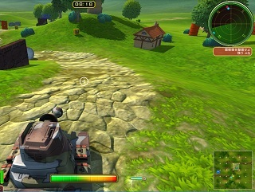
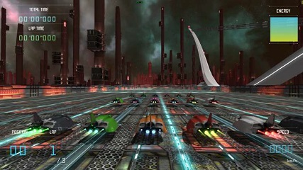

usagi
=====

Usagi is a platform independent hierarchical [Entity-Component-System](https://github.com/vitei/Usagi/wiki/Component-entity-system) based game engine created by [Vitei Inc.](http://www.vitei.com/).  

In Usagi the entire world is grouped into a hierarchy of entities. These entities are very fine grained, every bone on every character is an entity, with optional additional logical entities where required.  

Only components have data, and only systems have code. Entities are a concept to tie together a collection of components and the systems to be run on them; they have neither data nor code.  

The systems to be run are determined by the components attatched to an entity.
Systems can only act on components from one entity, but they can read from components belonging to parent entities.  

For example, the update UpdateSoundActor system will act on any entity with a SoundActorComponent which also has a MatrixComponent in its self or one of its parents. If a RigidBody component exists it will also use that to set a velocity on the SoundActorComponent.
```cpp
class UpdateSoundActor : public System
{
public:

   struct Inputs
   {
      Required<MatrixComponent, FromSelfOrParents>  mtx;
      Required<SoundActorComponent>                 actor;
      Optional<RigidBody, FromSelfOrParents>	    rigidBody;
   };

   struct Outputs
   {
      Required<SoundActorComponent>	actor;
   };

   DECLARE_SYSTEM(usg::SYSTEM_POST_TRANSFORM)

   static  void	 LateUpdate(const Inputs& inputs, Outputs& outputs, float fDelta)
   {
      SoundActorHandle& actor = outputs.actor.GetRuntimeData().hndl;
      actor.SetPosition(inputs.mtx->matrix.vPos().v3());
      if (inputs.rigidBody.Exists())
      {
         actor.SetVelocity(physics::GetLinearVelocity(inputs.rigidBody));
      }
   }
};
```

Components of other entities are never directly written to, events are used to communicate between entities

```cpp
static void OnEvent(const Inputs& inputs, Outputs& outputs, const KillEntityEvent& killEntity)
{
	outputs.state.Modify().current = STATUS_DEAD;
}
```

By [modifying the ECS design pattern](https://github.com/vitei/Usagi/wiki/Component-entity-system-coding) to put a hierarchy at its core we believe we have created a paradigm which is far more practical when trying to manage the complex interactions required in a modern game, as well as improving multi-threading potential.  


The word Usagi is Japanese for rabbit. Rabbits are quick, nimble and light, and that was our goal for the engine. Vitei was developing  games limited in scope but with high technical demands for Nintendo platforms, so we set about creating an engine suited to those titles.  

The public release supports Windows, but the currently unmaintained Mac code is also included, both Vulkan and OpenGL versions of the rendering code are publically available - but internally the interface has been proven on everything from 3DS to XBoxOne.  

The engine has been proven on a [commerical title](https://www.nintendo.co.uk/Games/Nintendo-3DS-download-software/Tank-Troopers-1136173.html) as well as several internal demos on numerous platforms and APIs.  


  

The open source release is currently in progress, for more details see the [introduction](https://github.com/vitei/Usagi/wiki/Introduction) and [roadmap](https://github.com/vitei/Usagi/wiki/Roadmap).  

The engine fully supported online multiplayer and more modern shader based platforms; unfortunately these features were not highlighted in its one commercial title, but work is progressing to demonstrate that potential. Contributions to help meet the goals of the roadmap from those with relevant experience would be considered.

More detailed information is available in the [wiki](https://github.com/vitei/Usagi/wiki).  


Getting up and running
----------------------

The build process has not been improved or significantly modified and currently has a number of dependencies which can not be directly included in an open source project.  Do *not* clone this project first as it should be checked out to a sub folder of a project which uses the engine.

1. Install **Visual Studio 2017**.  
   https://www.visualstudio.com/downloads/

1. Install **Ruby 2.3.3**.  
   Make sure that you select the option to add a path variable  
   Note that versions newer than 2.4 will not function with nokogiri  
   https://rubyinstaller.org/

1. Install **Python 2.7.14**.  
   Make sure that you select the option to add a path variable  
   https://www.python.org/downloads/

1. Clone the **PhysX repository 3.4**.  
   Requires accepting a EULA  
   https://developer.nvidia.com/physx-source-github  

1. Build the PhysX binaries  
   [**PhysX Checkout Dir**]\PhysX_3.4\Source\compiler\vc15win64\PhysX.sln and compile for both debug and release  
   Use the project located in Source\compiler\vc15win64  
   Note that you must currently change the default options to build with Multi-threaded Debug DLL and Multi-threaded DLL

1. **Optional** Install the **FBX SDK 2019.0 VS2015**.  
   Not necessary to run, but required to build the model converter (Ayataka)
   https://www.autodesk.com/products/fbx/overview

1. **Optional** Install and build the **Oculus SDK for Windows**.  
   Not necessary to run, but required if you want to make a VR app  
   Again Note that you must currently change the default options to build with Multi-threaded Debug DLL and Multi-threaded DLL
   https://developer.oculus.com/downloads/package/oculus-sdk-for-windows/

1. Clone an Usagi based Project  
   For example [UsagiTest](https://github.com/vitei/UsagiTest)  
   Always clone Usagi repos recursively as we make heavy use of submodules  
   **OR**  
   [Create a new one](https://github.com/vitei/Usagi/wiki/Creating-a-New-Project)  

1. From a command window run **Setup.bat**  
   If gems fail to install confirm your ruby version  
   If python packages fail to install confirm your python version  
   Pay attention to which environmet variables EnvironmentSetup.exe failed to set  
   Note you must run environment setup whenever you switch to running a different Usagi project in order to set the correct USAGI_DIR env variable  

1. Add the following environment variables either manually or by running EnvironmentSetup.exe  
   MSBUILD_DIR -> [**Visual Studio Install Dir**]\MSBuild\15.0\Bin  
   FBXSDK_DIR -> [**FBX SDK Install Dir**]\2019.0  
   USAGI_DIR -> [**This checkout**]  

1. Manually add the following environment variables  
   EnvironmentSetup.exe may have been able to automatically find and add them if they were in ../../PhysX-3.4 and ../../OculusSDK  
   PHYSX_DIR -> [**PhysX Checkout Dir**]\PhysX_3.4  
   OCULUS_SDK_DIR -> [**Oculus SDK directory**]  

1. Reset to ensure environment variable changes take effect  

1. Follow the instructions in that projects README.md  

Current Version 0.2.1
----------------------

With v0.2 the engine was switched from OpenGL to Vulkan  
v0.2.1 enables Vulkan validation and has addressed the issues that presented. It has also updated the old particle editor to Vulkan as its replacement is not yet ready.  

Since the code base is in a very early state the assumption is no one outside of the original developers are using the code base for anything other than reference; if you do attempt to make a project in Usagi be aware that you may periodically have to delete your build files (directories that begin with an underscore (such as _build) may periodically have to be deleted as the build system is altered.

Issues
----------------------

**The current is a list of known issues with Usagi which need to be addressed.**

If there is not at least one child entity systems on the root entity will not be run  

There is no longer a system other than submodules for linking projects and engine versions  

A replacement model editor would be required to take advantage of the existing custom shader support  

Resource loading is slow and single threaded  

Resources don't have an internal list of dependenices  

The running of systems is not yet multi-threaded  

Spot and projection lights are not properlly culled  

The AI would need updating to be able to control flying vehicles  


License
----------------------

Usagi its self is available under the MIT licence (see [LICENSE](LICENSE) in this repository). We would appreciate you letting us know if you make use of any part of the code or the design; but there is no requirement to do so.  
Third party software falls under the MIT, Modified BSD and zLib licenses, the specifics of which are detailed in [Documents/License.md](Documents/License.md)
